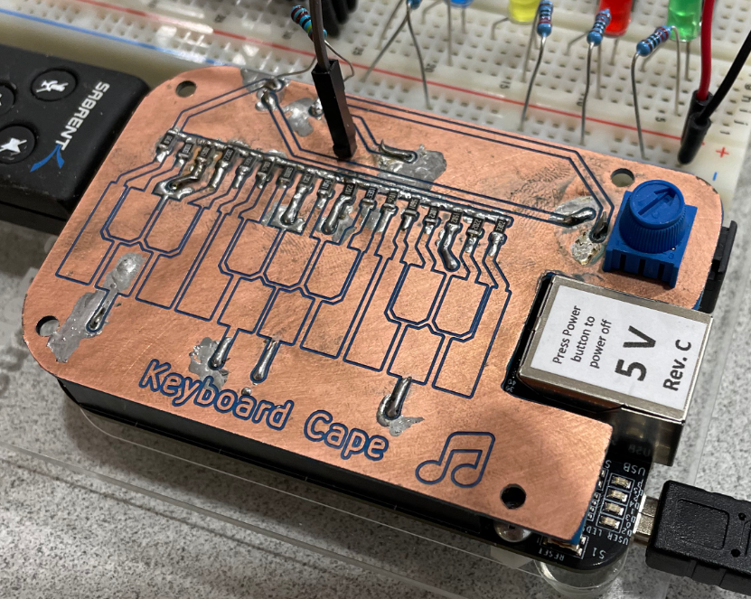
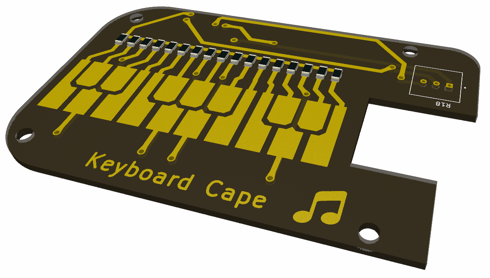
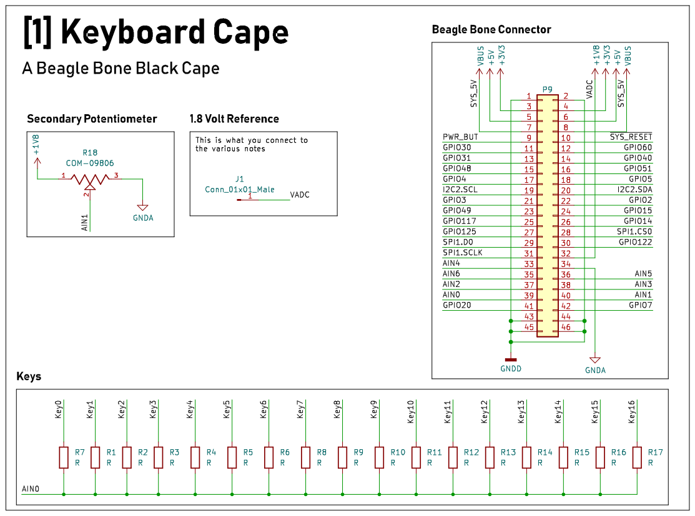
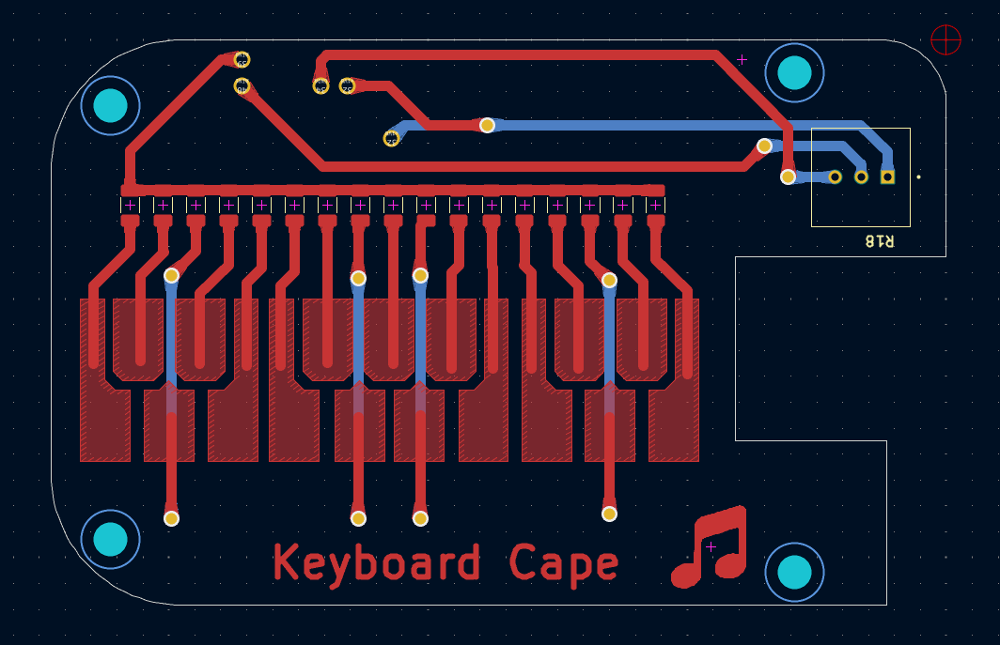
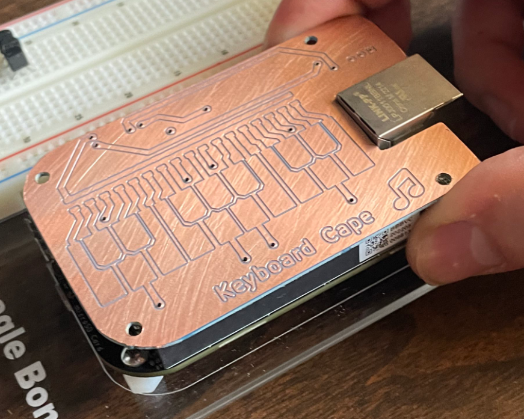

# ECE434 Digital Synth Project
Logan Manthey


<!-- markdown-toc start - Don't edit this section. Run M-x markdown-toc-refresh-toc -->
**Table of Contents**

- [ECE434 Digital Synth Project](#ece434-digital-synth-project)
    - [Executive Summary](#executive-summary)
    - [Packaging](#packaging)
    - [Installation Instructions](#installation-instructions)
    - [User Instructions](#user-instructions)
    - [Highlights](#highlights)
        - [Video](#video)
    - [Theory of Operation](#theory-of-operation)
        - [Hardware](#hardware)
            - [BOM](#bom)
            - [Keyboard Section](#keyboard-section)
                - [Schematic and PCB](#schematic-and-pcb)
                - [Resistor List for Note Values](#resistor-list-for-note-values)
            - [Pot Section](#pot-section)
        - [Software](#software)
            - [Reading in the values](#reading-in-the-values)
            - [Creating Sound](#creating-sound)
            - [Start Up](#start-up)
    - [Work Breakdown](#work-breakdown)
    - [Future Work](#future-work)
    - [Conclusions](#conclusions)

<!-- markdown-toc end -->


## Executive Summary

|  | 
|:--:| 
| *Project Overview* |


This project is centered around making a digital synth using a custom designed keyboard cape. The inspiration for this project came from the Stylophone, an analog synth which used a stylus keyboard.

<!---
Give two sentence intro to the project.
Give two sentences telling what works.
Give two sentences telling what isn't working.
End with a two sentence conclusion.
The sentence count is approximate and only to give an idea of the expected length.
-->

## Packaging
***If you have hardware, consider Small Build, Big Execuition for ideas on the final packaging.

## Installation Instructions
***Give step by step instructions on how to install your project.
- Read-only GitHub: https://github.com/manthelt/ECE434FinalProject

1. Clone the repo
2. Run sudo ./install.sh
3. Run sudo ./setup.sh

- Custom PCB schematic in 'Schematic and PCB'
- USB Surround Sound Adapter: https://sabrent.com/products/usb-sbcv
<!-- Include your github path as a link like this to the read-only git site: https://github.com/MarkAYoder/gitLearn. -->
<!-- Be sure your README.md is includes an up-to-date and clear description of your project so that someone who comes across you git repository can quickly learn what you did and how they can reproduce it. -->
<!-- Include a Makefile for your code if using C. -->
<!-- Include any additional packages installed via apt. Include install.sh and setup.sh files. -->
<!-- Include kernel mods. -->
<!-- If there is extra hardware needed, include links to where it can be obtained. -->

## User Instructions
1. Run ./soundExperiments.py
2. Visit https://localhost:8081
***Consider making it autostart for full credit. (add line to setup.sh)

## Highlights
***Here is where you brag about what your project can do.


### Video
***Here is a video that shows our project in operation.
[](https://www.youtube.com/watch?v=YOUTUBE_VIDEO_ID_HERE)


<!-- Include a YouTube demo the audio description. -->

## Theory of Operation
***Give a high level overview of the structure of your software. Are you using GStreamer? Show a diagram of the pipeline. Are you running multiple tasks? Show what they do and how they interact.


### Hardware
This section decribes the hardware portion of the project and which parts and designs were used.

#### BOM
    - 17 1206 Resistor of Varying Sizes
      -  [Resistor List for Note Values](#resistor-list-for-note-values)
    - 1 Potenimeter
    - 2 2 Pin Male Connectors
    - 1 1 Pin Male Connector 
*Note for the connectors I used large ones that I cut down to size*

#### Keyboard Section
This section decribes the keyboard section of the hardware and it's theory of operation 

|  | 
|:--:| 
| *Beagle Bone Keyboard Cape Render* |

In short this keyboard acts as a form of potentiometer where connecting the 1.8 volt line to the different nets allows a different value to be read by the analog input as there is a different resistor connected to each one of the note nets.

##### Schematic and PCB
The keyboard cape was designed using KiCAD EDA software. KiCAD is an open source easy to use EDA software that allowed us to quickly design and then print out a PCB prototype on campus using the CNC mill. If we were going to redesign this for real manufacture we would add more headers to make it more stable. We would also add a spot for a pull down resistor to the board itself.


|  | 
|:--:| 
| *Beagle Bone Keyboard Cape Schematic View* |


|  | 
|:--:| 
| *Beagle Bone Keyboard Cape PCB View* |


|  | 
|:--:| 
| *Beagle Bone Keyboard Cape Inital CNC Print* |


##### Resistor List for Note Values
These values were chosen to allow for a somewhat even distrubtion of values which will translate to a even distrubtion of values. We then added a pull down resistor to allow for a even larger distributing of notes. 

```
Note  Ohm
0     47000
1     33000
2     22000
3     15000
4     10000
5     6800
6     4700
7     3300
8     2200
9     1500
10    1000
11    680
12    470
13    330
14    220
15    150
16    100
17    0
```

#### Pot Section
In addition to the keyboard acting as a potentiometer there is also a normal potentiometer that can act as a volume control or however you would like to program it. That potentiometer is located here.

|  | 
|:--:| 
| *Beagle Bone Keyboard Cape Inital Print* |


### Software

#### Reading in the values
- Analog input via /sys/bus/iio
- Button input via gpio

#### Creating Sound
***This section talks about how the sound is created 

#### Start Up
***Talk about how the software boots up on startup


## Work Breakdown

- PCB Design and Solder
  Logan

- Sound Generation and USB Audio
  Logan, Ash, Larissa

- LCD Visualisation (not working - dropped)
  Ash, Larissa

- Flask
  Ash, Larissa

- Documentation
  Logan, Ash, Larissa

## Future Work
In the future we would modify the cape a bit and add a spot for a pull down resistor along with getting it professionally printed to allow for a silk screen on it. I would also add more pins to the header to allow for more stability. We would also like to be able to get audio visualisation via the LCD working.

***Suggest addition things that could be done with this project.

## Conclusions
***Give some concluding thoughts about the project. Suggest some future additions that could make it even more interesting.


