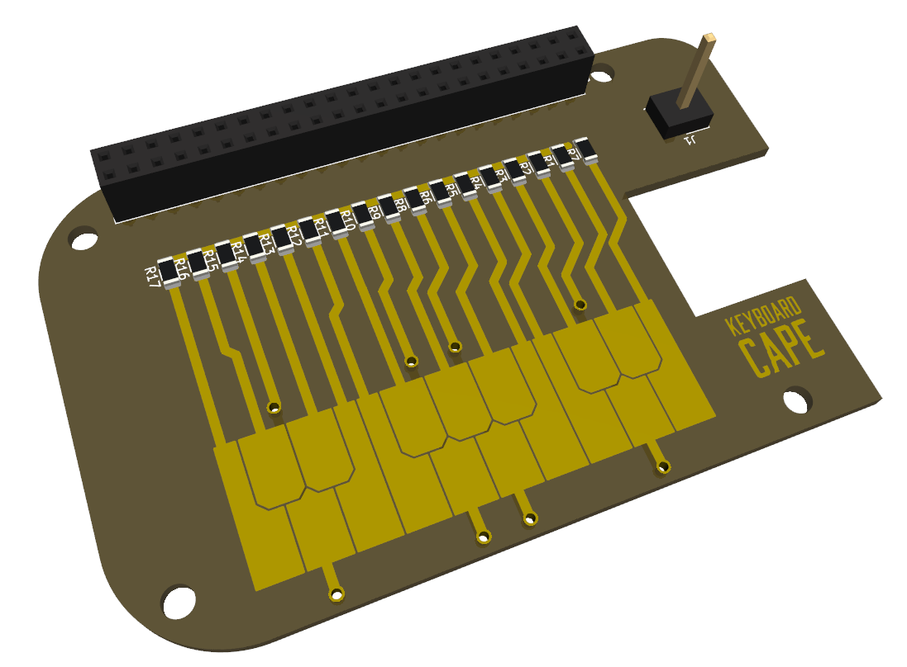

# ECE434 Digital Synth Project
Logan Manthey

<!-- markdown-toc start - Don't edit this section. Run M-x markdown-toc-refresh-toc -->
**Table of Contents**

- [ECE434 Digital Synth Project](#ece434-digital-synth-project)
    - [Executive Summary](#executive-summary)
    - [Packaging](#packaging)
    - [Installation Instructions](#installation-instructions)
    - [User Instructions](#user-instructions)
    - [Highlights](#highlights)
    - [Theory of Operation](#theory-of-operation)
    - [Work Breakdown](#work-breakdown)
    - [Future Work](#future-work)
    - [Conclusions](#conclusions)

<!-- markdown-toc end -->

## Executive Summary
Picture that summarizes the project.

|  | 
|:--:| 
| *This shows a quick mock up of the BeagleBoneCape for my Synth* |

Give two sentence intro to the project.

Give two sentences telling what works.

Give two sentences telling what isn't working.

End with a two sentence conclusion.

The sentence count is approximate and only to give an idea of the expected length.

## Packaging
If you have hardware, consider Small Build, Big Execuition for ideas on the final packaging.

## Installation Instructions
Give step by step instructions on how to install your project.

Include your github path as a link like this to the read-only git site: https://github.com/MarkAYoder/gitLearn.
Be sure your README.md is includes an up-to-date and clear description of your project so that someone who comes across you git repository can quickly learn what you did and how they can reproduce it.
Include a Makefile for your code if using C.
Include any additional packages installed via apt. Include install.sh and setup.sh files.
Include kernel mods.
If there is extra hardware needed, include links to where it can be obtained.

## User Instructions
Once everything is installed, how do you use the program? Give details here, so if you have a long user manual, link to it here.

Consider making it autostart for full credit.

## Highlights
Here is where you brag about what your project can do.

Include a YouTube demo the audio description.

## Theory of Operation
Give a high level overview of the structure of your software. Are you using GStreamer? Show a diagram of the pipeline. Are you running multiple tasks? Show what they do and how they interact.

## Work Breakdown
List the major tasks in your project and who did what.

Also list here what doesn't work yet and when you think it will be finished and who is finishing it.

## Future Work
Suggest addition things that could be done with this project.

## Conclusions
Give some concluding thoughts about the project. Suggest some future additions that could make it even more interesting.
