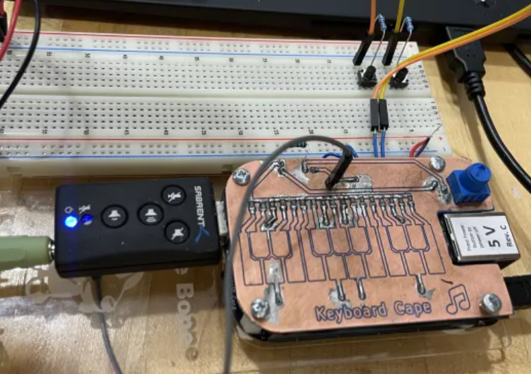
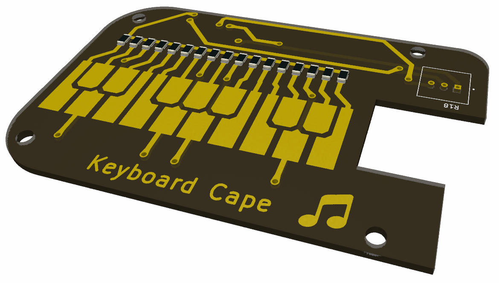
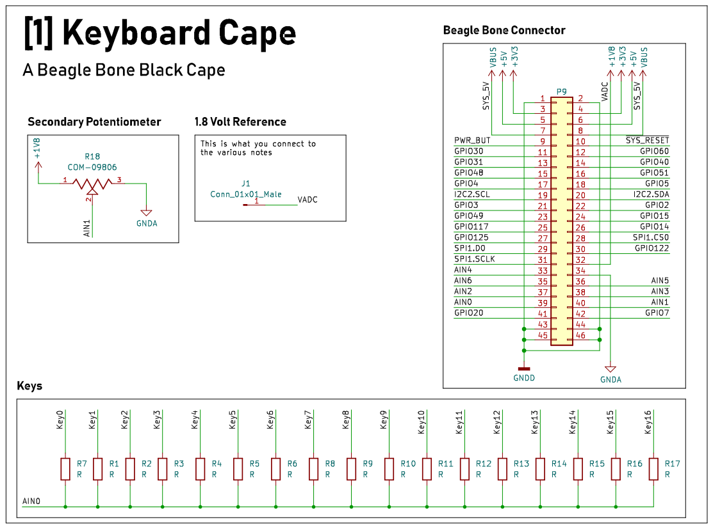
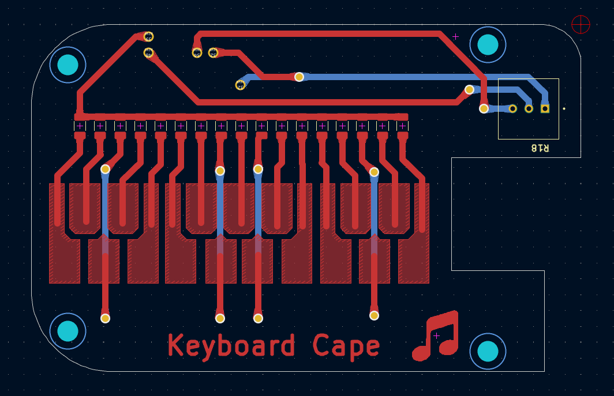
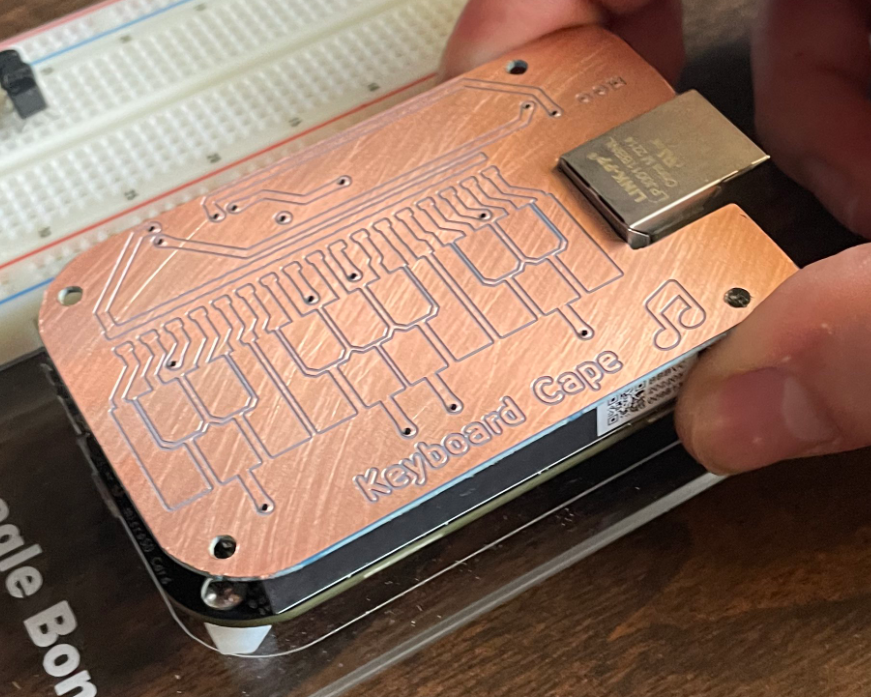
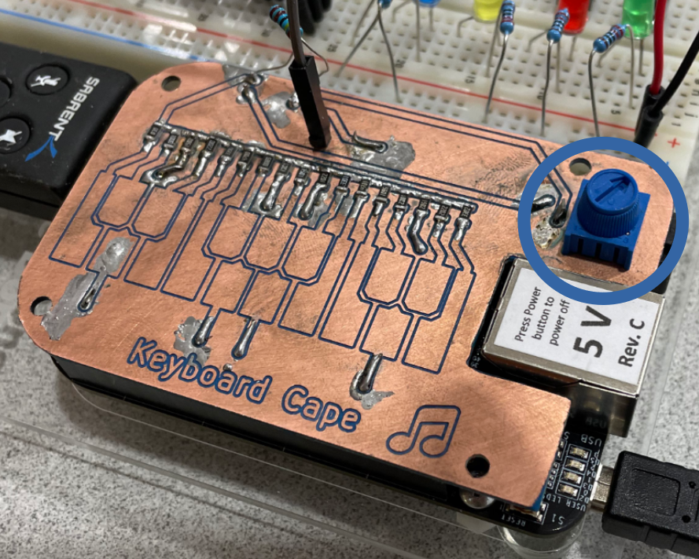

# ECE434 Sound Project
Logan Manthey, Ash 

<!-- markdown-toc start - Don't edit this section. Run M-x markdown-toc-refresh-toc -->
**Table of Contents**

- [ECE434 Sound Project](#ece434-sound-project)
    - [Executive Summary](#executive-summary)
    - [Packaging](#packaging)
    - [Installation Instructions](#installation-instructions)
    - [User Instructions](#user-instructions)
    - [Highlights](#highlights)
        - [Video](#video)
    - [Theory of Operation](#theory-of-operation)
        - [Hardware](#hardware)
            - [BOM](#bom)
            - [Keyboard Section](#keyboard-section)
                - [Schematic and PCB](#schematic-and-pcb)
                - [Resistor List for Note Values](#resistor-list-for-note-values)
            - [Pot Section](#pot-section)
        - [Software](#software)
            - [Reading in the values](#reading-in-the-values)
            - [Creating Sound](#creating-sound)
            - [Storing Recorded Sound](#storing-recorded-sound)
            - [Start Up](#start-up)
    - [Work Breakdown](#work-breakdown)
    - [Future Work](#future-work)
    - [Conclusions](#conclusions)

<!-- markdown-toc end -->


## Executive Summary

|  | 
|:--:| 
| *Project Overview* |


This project is centered around making a digital synth using a custom designed keyboard cape. The inspiration for this project came from the Stylophone, an analog synth which used a stylus keyboard. Our project currently has capability to play songs, navigate songs, take and play user input, record and play back user input, and has two octaves for that "manual mode". We also have a simple UI via Flask for the controls, and the display of the title of the current song. We wanted to add audio visualisation on an LCD, but we were barely even able to get anything to display on the LCD. We gave that up as we sunk too many hours into it and would rather add new features. Our project has many different capabilities related to sound.

<!---
Give two sentence intro to the project.
Give two sentences telling what works.
Give two sentences telling what isn't working.
End with a two sentence conclusion.
The sentence count is approximate and only to give an idea of the expected length.
-->

## Packaging
- Most of our product is standard wires, pots, switch buttons, etc. except for our custom "Keyboard Cape"
- Our cape acts as a voltage divider, allowing us to read in analog values of voltage to differentiate between notes

## Installation Instructions
- Read-only GitHub: https://github.com/manthelt/ECE434FinalProject

1. Clone the repo
2. Run sudo ./install.sh
3. Run sudo ./setup.sh

- Custom PCB schematic in 'Schematic and PCB'
- USB Surround Sound Adapter: https://sabrent.com/products/usb-sbcv
<!-- Include your github path as a link like this to the read-only git site: https://github.com/MarkAYoder/gitLearn. -->
<!-- Be sure your README.md is includes an up-to-date and clear description of your project so that someone who comes across you git repository can quickly learn what you did and how they can reproduce it. -->
<!-- Include a Makefile for your code if using C. -->
<!-- Include any additional packages installed via apt. Include install.sh and setup.sh files. -->
<!-- Include kernel mods. -->
<!-- If there is extra hardware needed, include links to where it can be obtained. -->

## User Instructions
1. Run ./soundExperiments.py
2. Visit https://localhost:8081
***Consider making it autostart for full credit. (add line to setup.sh)

## Highlights
- Play a variety of songs
- Backward, pause/play, and skip functionalities
- "Manual mode" that allows the user to play their own sequence of notes
- Record a sequence of notes and play them back


### Video
***Here is a video that shows our project in operation.
[](https://www.youtube.com/watch?v=YOUTUBE_VIDEO_ID_HERE)

<!-- Include a YouTube demo the audio description. -->

## Theory of Operation
- Input from buttons > navigate through songs > display via Flask
- Input from cape while in manual mode > play various notes
- Manual mode is navigated to the same way other songs are > input only taken in during manual mode > other songs do not play during manual mode

***Give a high level overview of the structure of your software. Are you using GStreamer? Show a diagram of the pipeline. Are you running multiple tasks? Show what they do and how they interact.


### Hardware
This section decribes the hardware portion of the project and which parts and designs were used.

#### BOM
    - 17 1206 Resistor of Varying Sizes
      -  [Resistor List for Note Values](#resistor-list-for-note-values)
    - 1 Potenimeter
    - 2 2 Pin Male Connectors
    - 1 1 Pin Male Connector 
*Note for the connectors I used large ones that I cut down to size*

#### Keyboard Section
This section decribes the keyboard section of the hardware and it's theory of operation 

|  | 
|:--:| 
| *Beagle Bone Keyboard Cape Render* |

In short this keyboard acts as a form of potentiometer where connecting the 1.8 volt line to the different nets allows a different value to be read by the analog input as there is a different resistor connected to each one of the note nets.

##### Schematic and PCB
The keyboard cape was designed using KiCAD EDA software. KiCAD is an open source easy to use EDA software that allowed us to quickly design and then print out a PCB prototype on campus using the CNC mill. If we were going to redesign this for real manufacture we would add more headers to make it more stable. We would also add a spot for a pull down resistor to the board itself.


|  | 
|:--:| 
| *Beagle Bone Keyboard Cape Schematic View* |


|  | 
|:--:| 
| *Beagle Bone Keyboard Cape PCB View* |


|  | 
|:--:| 
| *Beagle Bone Keyboard Cape Inital CNC Print* |


##### Resistor List for Note Values
These values were chosen to allow for a somewhat even distrubtion of values which will translate to a even distrubtion of values. We then added a pull down resistor to allow for a even larger distributing of notes. 

```
Note  Ohm
0     47000
1     33000
2     22000
3     15000
4     10000
5     6800
6     4700
7     3300
8     2200
9     1500
10    1000
11    680
12    470
13    330
14    220
15    150
16    100
17    0
```

#### Pot Section
In addition to the keyboard acting as a potentiometer there is also a normal potentiometer that can act as a volume control or however you would like to program it. That potentiometer is located here.

|  | 
|:--:| 
| *Beagle Bone Keyboard Cape Inital Print* |


### Software

#### Reading in the values
- Analog input via /sys/bus/iio
- Button input via gpio

#### Creating Sound
- While in manual mode, user hits the keys with connected wire
- Software reads in analog voltage input via /sys/bus/iio
- That analog voltage value corresponds to a frequency that is then played

#### Storing Recorded Sound
- User hits keys
- Notes are read in via /sys/bus/iio
- Durations are determined based on the time the user started playing the note and when they stopped

#### Start Up
<!-- ***Talk about how the software boots up on startu -->p
To boot the software a systemd service can be used with the flask application. 

## Work Breakdown

- PCB Design and Solder
  Logan

- Sound Generation and USB Audio
  Logan, Ash, Larissa

- LCD Visualization (not working - dropped)
  Ash, Larissa

- Flask
  Ash, Larissa

- Documentation
  Logan, Ash, Larissa

## Future Work
In the future we would modify the cape a bit and add a spot for a pull down resistor along with getting it professionally printed to allow for a silk screen on it. I would also add more pins to the header to allow for more stability. We would also like to be able to get audio visualisation via the LCD working.

<!-- ***Suggest addition things that could be done with this project. -->

Future Additions
       - More features on the Flask App
       - More Synth Options and possbile Digital Signal Processing
         - Possible Second Pot Features
           - Pitch Bend
           - Wave Adjustment (Example: Sin Wave to Sawtooth to Square)
        - Being able to play over background songs and beats
          - This would let you solo with the keyboard over tunes like free bird
        - Adding a loop for recording playback would be able to allow for more intense soloing
        - LCD Screen
          - We attempted to get the LCD screen to work with the bone but this proved to be very
            difficult especially with a UI if we had LCD working with it we could make it into a
            smaller self contained package
        - Hardware
          - Adding buttons to the cape
          - Making the cape more stable on the bone
          - Printing the PCB at a PCB House


## Conclusions
<!-- ***Give some concluding thoughts about the project. Suggest some future additions that could make it even more interesting. -->

Overall our group thinks our project was a success. Our approach of making something simple and
adding features to it proved to be very useful and allowed us to pivot as needed. This also
allowed us to always have something to demo at every stage of our project. We also thought
the interactive nature of the project made this a really fun project to demo.

Above in future work shows a few different features that we would like to add to the project.
